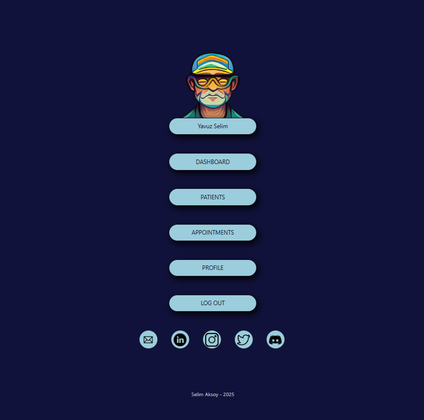
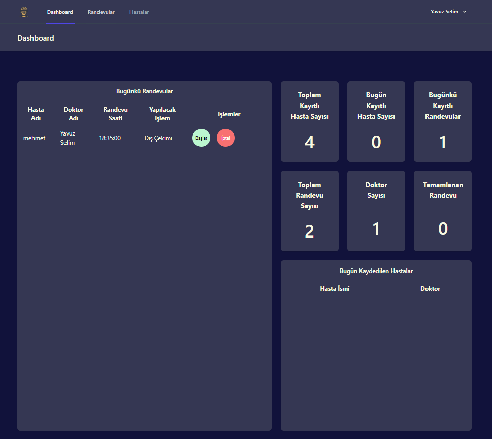
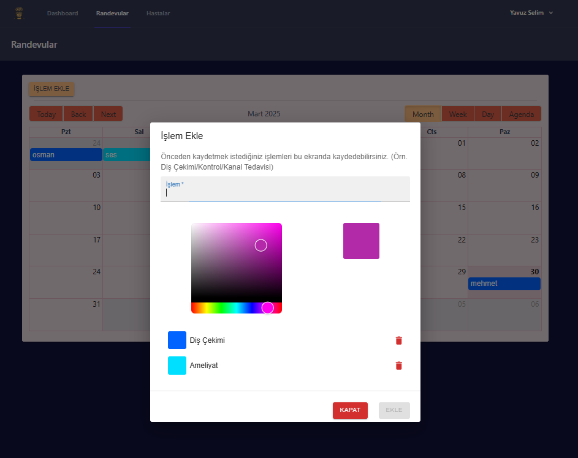
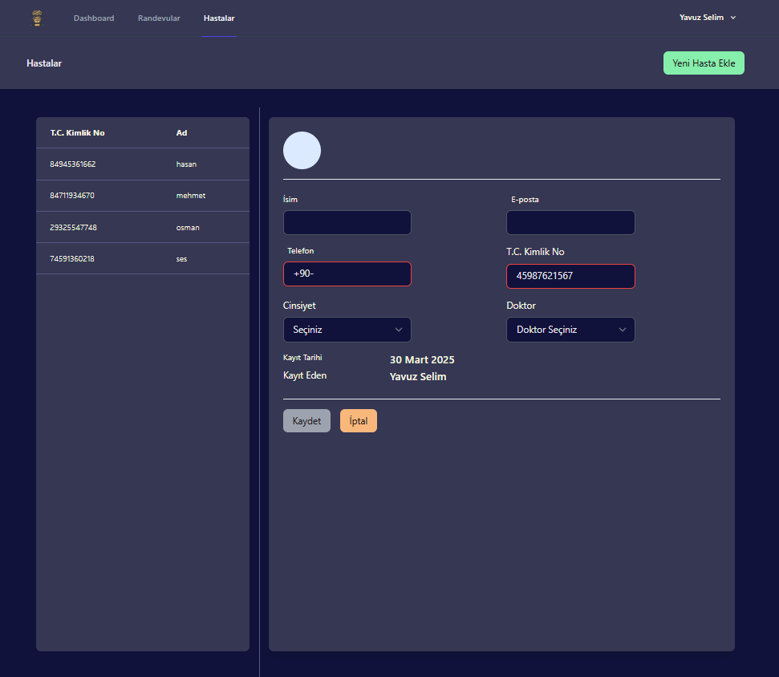
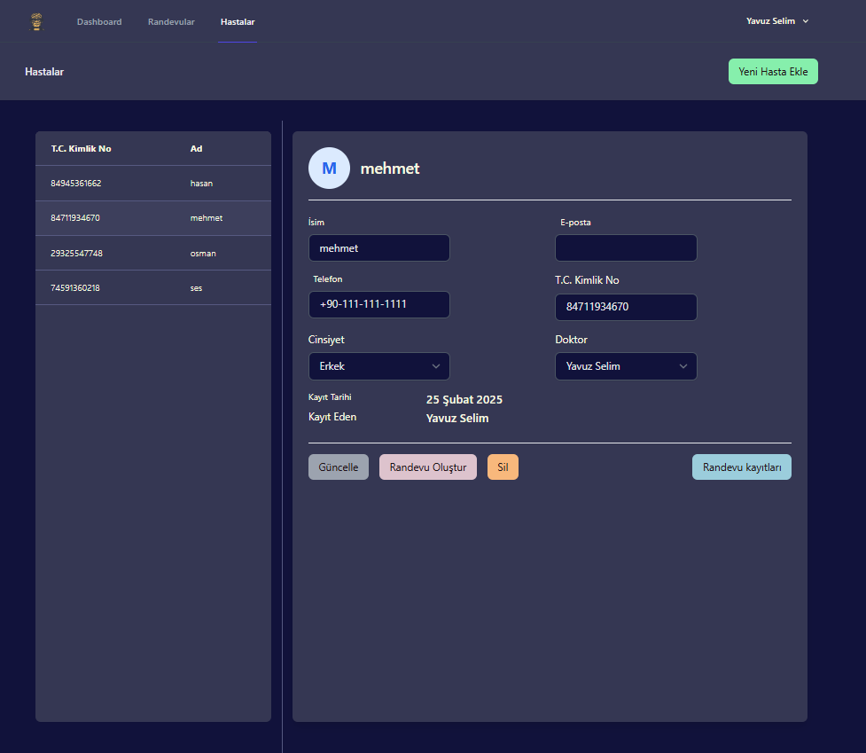
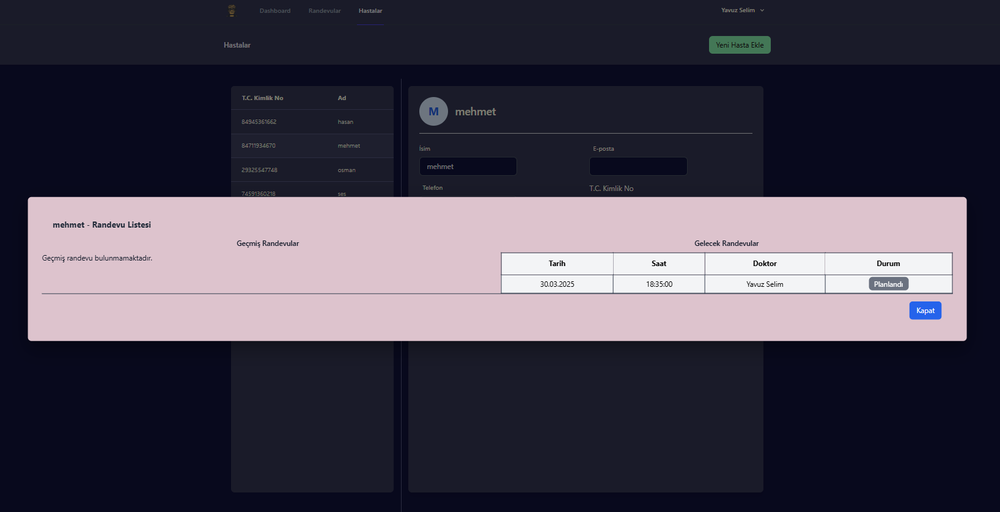
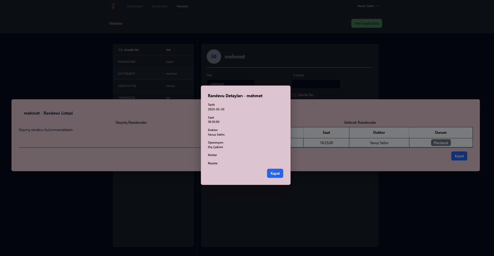
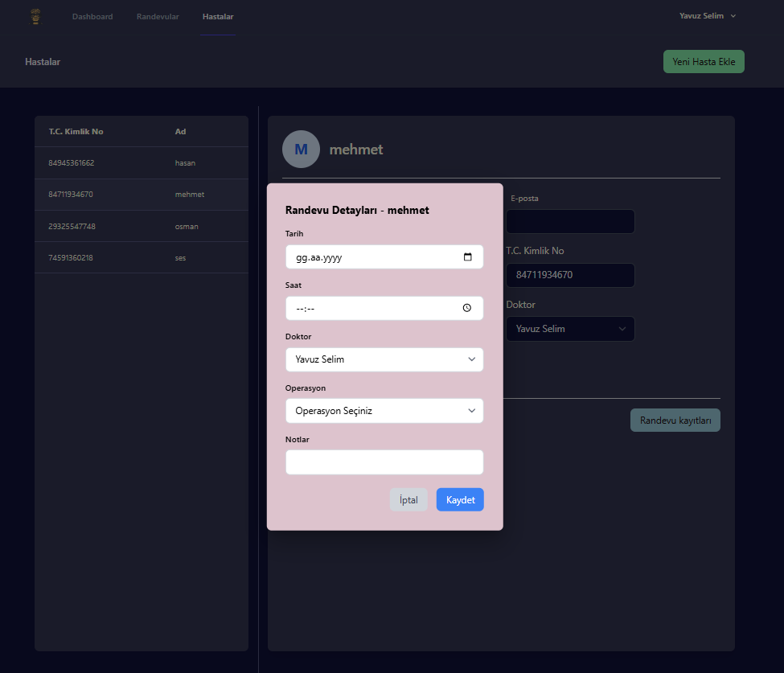
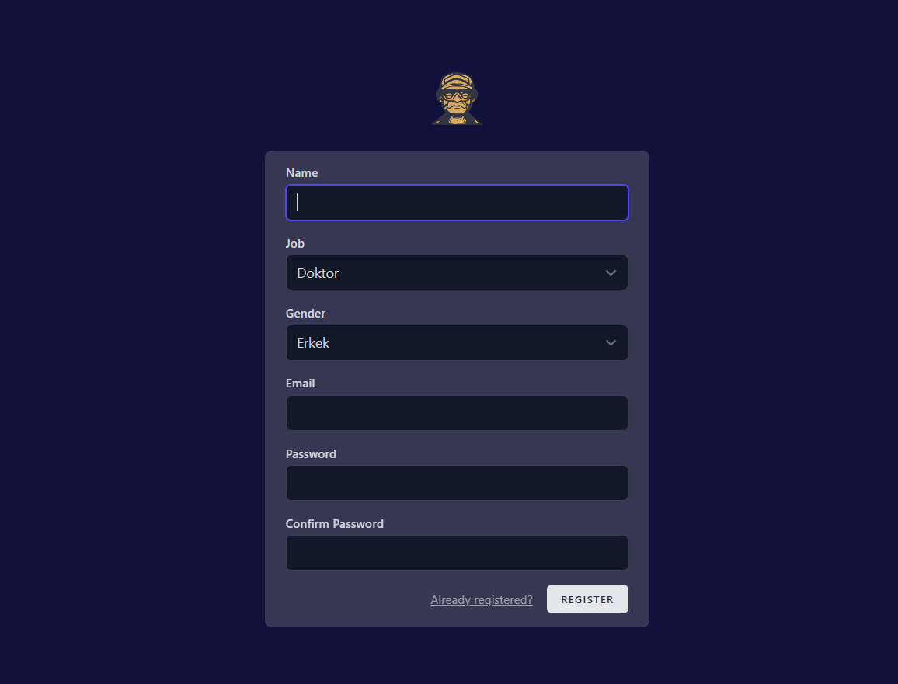

# Hasta Kayıt Sistemi

## Yazar: Yavuz Selim Aksoy
İSTE - Bilgisayar Mühendisliği

## Özet
Bu döküman, Laravel konusundaki yetkinliğimi geliştirmek amacıyla oluşturduğum hasta kayıt sistemi web sitesinin detaylarını açıklamaktadır. Bu web sitesi, diş hekimlerinin hastalarını kaydetmelerini, hastalar için kolayca randevu oluşturmalarını ve randevuları kullanıcı dostu bir arayüz üzerinden görüntülemelerini sağlamayı hedeflemektedir. Proje, **Laravel, React, Inertia ve SQLite** kullanılarak geliştirilmiştir.

Bu proje bir **demo** olarak hazırlanmıştır ve şu an için aktif kullanıma açılması planlanmamaktadır.

### [Demo Websitesi İçin Tıklayın](http://3.121.87.98:8080/)

---

## 1. Projeye Başlama Sebebi
Projeye başlama sebebim, diş hekimi olan bir yakınım için daha fazla kontrol sahibi olabileceği profesyonel bir hasta kayıt sistemi oluşturmaktı. Ancak, derslerime odaklanmam ve Erasmus değişim programıyla ilgili belgelerle ilgilenmem gerektiğinden projeye ara vermek zorunda kaldım. Ayrıca, bu alan beni yeterince cezbetmediği için ilgimi kaybetmiş olabilirim.

Bu dökümanı yazarken **Almanya'daki Aalen Üniversitesi'nde** bir dönemlik değişim programına devam ediyor ve zaman buldukça yeni projeler üzerinde çalışıyorum. Bu dökümanı hazırlamamın temel amacı, ileride oluşturacağım projelerin anlatımına yönelik kendimi geliştirmek ve projeleri daha profesyonel bir şekilde dökümante etmeye alışmaktır. Bir projenin en önemli yönlerinden biri, onu geliştirmek kadar detaylı bir şekilde anlatabilmek olduğuna inanıyorum.

---

## 2. Ana Sayfa

### **Tema**
Web sitesi aktif kullanım için planlanmadığından, ana sayfanın temasını kişisel web sitemin tasarımıyla aynı bıraktım. Sayfa, geçmişte yapay zeka ile oluşturduğum bir logoyu ve CSS denemeleri sırasında tasarladığım arayüzü içermektedir.

### **İçerik**
Ana sayfa üzerinden kullanıcılar hesaplarına giriş yapabilir, yeni bir hesap oluşturabilir veya diğer sayfalara doğrudan erişebilirler. Hesaba giriş yapılmadan önce yalnızca "Giriş Yap" ve "Kayıt Ol" butonları görüntülenmektedir. Bu butonlar, **Laravel'in varsayılan giriş ve kayıt sayfalarına** yönlendirmektedir.

**Sayfanın en alt bölümünde, sosyal medya hesaplarına yönlendiren butonlar bulunmaktadır.**

---

## 3. Panel Sayfası

### **Sol Bölüm**
Bu alanda, bugüne ait planlanmış randevular listelenmektedir. Her randevunun yanında **"Başlat" ve "İptal"** butonları bulunmaktadır. "Başlat" butonu, randevuyu tamamlanmış olarak işaretlerken, "İptal" butonu randevunun iptal edilmesini sağlar. Ayrıca, **randevu saati yaklaştıkça ilgili satır sarıya dönerken, randevu saati geçtiğinde arka plan kırmızıya dönüşmektedir.**

### **Sağ Bölüm**
Bu alanın üst kısmında çeşitli sayısal veriler gösterilirken, alt kısmında gün içerisinde kaydedilen hastaların bilgileri listelenmektedir.

---

## 4. Takvim Sayfası

### **Takvim**
Bu bölüm, oluşturulan randevuların kullanıcı dostu bir arayüzde görüntülenmesini sağlamaktadır. Takvim üzerinde yer alan randevulara tıklanarak randevu detaylarına erişilebilir. Takvim, **günlük, haftalık, aylık veya ajanda modlarında görüntülenebilir** ve kolay bir kullanım sunmaktadır.

> **Not:** Takvim arayüzü, internetten hazır olarak indirilip özelleştirilerek kullanılmıştır. [Kaynak](https://github.com/jquense/react-big-calendar)

### **Operasyon Ekleme**
Sol üst köşede bulunan **"İşlem Ekle"** butonu, önceden tanımlanmış operasyonları oluşturmak ve bu operasyonlara renk teması atamak için kullanılmaktadır. Bu sayede, takvim arayüzü daha düzenli ve anlaşılır hale gelerek estetik bir görünüm kazanmaktadır.

---

## 5. Hastalar Sayfası

### **Hasta Kayıt**
"Yeni Hasta Ekle" butonuna basıldığında açılan sayfa, hasta kayıt işlemlerinin gerçekleştirildiği bölümdür. **E-posta alanı hariç tüm zorunlu alanların eksiksiz doldurulması gerekmektedir.** Ayrıca, **TC Kimlik Numarası ve telefon numarası alanlarına rastgele değerlerin girilmesini engellemek amacıyla özel algoritmalar kullanılmıştır.**

### **Hasta Detay**
Sol bölümde görünen kayıtlı hastaların detaylarını görüntüleyebileceğiniz sayfadır. **Bu bölümde hasta bilgileri üzerinde düzenlemeler yapabilir, ayrıca alt kısımda yer alan butonları kullanarak yeni randevu oluşturabilir veya mevcut randevu kayıtlarını görüntüleyebilirsiniz.**

### **Randevu Kayıtları Görüntüleme**
Seçilen hastanın geçmiş ve planlanan randevularını görüntüleyebileceğiniz bir modüldür. **Her bir randevuya tıklayarak detaylarını inceleyebilirsiniz.**

### **Randevu Oluşturma**
Bu modül, seçilen hasta için randevu oluşturmanıza olanak tanır. **Randevuya özel not ekleyebilir ve oluşturduğunuz randevuları takvim sayfasında görüntüleyebilirsiniz.** Eğer operasyon seçimi alanı boş ise, **lütfen önce takvim sayfasından yeni bir operasyon ekleyip ardından bu sayfaya geri dönünüz.**

---

## 6. Kayıt Olma Sayfası

Laravel'in varsayılan temasına eklemeler yapılarak düzenlenmiş kayıt olma sayfasıdır. **Bu sayfa aracılığıyla sisteme "Doktor", "Asistan" veya "Çalışan" olarak kayıt olabilirsiniz.**

Doktor olarak profil oluşturduğunuzda, randevular ve hasta profilleri için kendinizi doktor olarak atayabilirsiniz.

---

## 7. Kaynaklar
- [React Big Calendar](https://github.com/jquense/react-big-calendar)
- **Bu proje, JetBrains PhpStorm IDE ve Laravel Framework kullanılarak geliştirilmiştir.**
- **Proje geliştirme sürecinde üretken yapay zekâdan yardım alınmıştır.**

## 8. Yazar
**Yavuz Selim Aksoy**  
📧 yavuzselimaksoy01@gmail.com  
